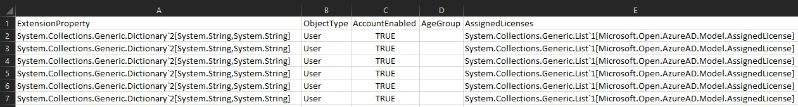

# Automation: AAD Guest User Report

Use an Azure Automation Runbook to generate a report of all the Guest identities in an Azure Active Directory (AAD) directory. The generated report will be copied to an Azure Storage account.  

## Requirments:

- Azure Automation Account
- Automation Run-As account granted rights to Azure Active Directory (AAD)
- Storage account

## Reporting:

The goal of this example is to generate a usage report of AAD guest users. This example includes two options for export data. Changing a variable in the script will select the output method. 

```PowerShell
# Output type (JSON/CSV)
$outputType = "JSON"
```

#### CSV

Export a Comma Seperated Value (CSV) list. The export can easily be viewed and edited with many tools including Microsoft Excel. CSV can be the more compatable opton for an export, but maintaining the data videlity is complicated. CSV does not handle multi-valued attributes easily. In this example the CSV will list the PowerShell object definition string for any multi-valued attributes included in the export. 



#### JSON

Export data in JavaScript Object Notation (JSON).

```JSON
[
    {
        "ExtensionProperty":  {
                                  "odata.type":  "Microsoft.DirectoryServices.User",
                                  "createdDateTime":  "5/20/2016 4:05:30 AM",
                                  "employeeId":  null,
                                  "onPremisesDistinguishedName":  null,
                                  "thumbnailPhoto@odata.mediaEditLink":  "directoryObjects/<>/Microsoft.DirectoryServices.User/thumbnailPhoto",
                                  "userIdentities":  "[]"
                              },
        "UserPrincipalName":  "daniel_<>#EXT#@<>.onmicrosoft.com",
        "UserState":  "Accepted",
        "UserStateChangedOn":  "2019-04-20T16:01:19Z",
        "UserType":  "Guest"
    }
]
```

### PowerBI Report

PowerBI can easily be configured to pull data from an Azure Storage account. The reports will automatically update as the contents of the storage account are updated. 


