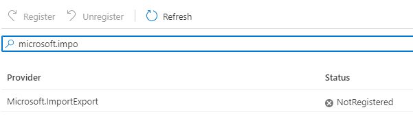

# DENY - Azure Storage Import/Export service

The Azure import/export service is a method for quickly moving large amount of data in and out of an Azure region by loading the data onto traditional hard drives, and shipping to and from Azure datacenters. 

In some situation it may be required to ensure that this service cannot be used to exfill data from an environment. 


## 1. Disable Resource Provider

The Azure Import/Export serivce is provided from the **Microsoft.ImportExport** resource provider. The resource provider can be disabled at the Subscription level to prevent the service from being provisioned. 

### unregister/disable Microsoft.ImportExport provider

Use one of the Azure command-line environments to manage the available resource providers. The following example using the Azure PowerShell module (az).

#### Azure Portal
From the desired subscription select **Resource Providers**. Find the Microsoft.ImportExport provider. The current status will be shown. The buttons at the top can be used to register (enabled) or unregister (disable).




#### Azure PowerShell (Az)

```powershell

Unregister-AzResourceProvider -ProviderNamespace "Microsoft.ImportExport"

```

## 2. Azure Policy - Deny Import/Export Jobs

Use Azure Policy to prevent any Import/Export from being created. The policy will be evaluated against all resource creations in the (scoped) environment. When the policy is matched the resource deployment (job) will be denied.

The following policy rule matches against any attempt to deploy a new Import/Export job, with the effect of Deny.

```json
{
      "parameters": {},
      "policyRule": {
        "if": {
          "field": "type",
          "equals": "Microsoft.ImportExport/jobs"
        },
        "then": {
          "effect": "deny"
        }
      }
    }
```