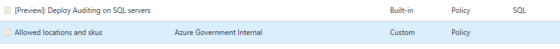
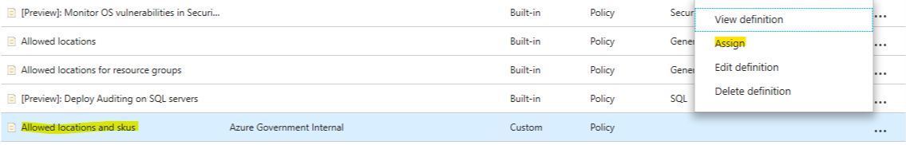
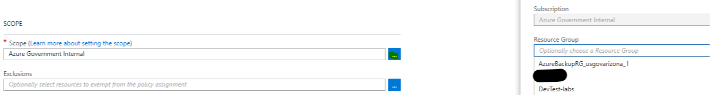
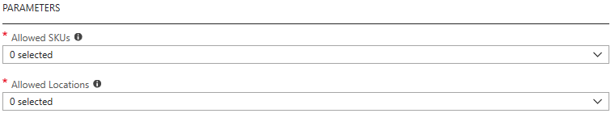

# Policy: Restrict VM Sku and Location

## Create policy definition

The following set of PowerShell commands will create a new Azure policy definition that dictates the which Azure regions and VM sizes (Sku) are allowed. Allowed values are selected when the policy is assigned.

```PowerShell
$definitionParametersUrl = 'https://raw.githubusercontent.com/hibbertda/Azure-ARM/master/policy%20examples/restrict-vm-sku/azurepolicy.parameters.json'
$definitionRulesUrl = 'https://raw.githubusercontent.com/hibbertda/Azure-ARM/master/policy%20examples/restrict-vm-sku/azurepolicy.rules.json'


$definition = New-AzureRmPolicyDefinition `
    -Name "hbl-llowed-sku-and-locations" `
    -DisplayName "Allowed locations and skus" `
    -description "Allowed VM skus and locations." `
    -Policy $definitionRulesUrl `
    -Parameter $definitionParametersUrl `
    -Mode All
```

After running the commands, the new policy definition will be available in the list of policy definitions.



## Create policy assignment

An Azure policy needs to be assigned before it will take effect. Policy scopes can cover an entire subscription or individual resource groups. 

### PowerShell

The following PowerShell commands will assign the policy to a resource group using an example JSON file. Change **Resource Group name** to match your desired resource group.

```PowerShell
$scope = (Get-AzureRMResourceGroup 'Resource Group Name').ResourceId

$assignmentParametersUrl = 'https://raw.githubusercontent.com/hibbertda/Azure-ARM/master/policy%20examples/restrict-vm-sku/allowed.json'

$assignment = New-AzureRmPolicyAssignment `
        -Name 'hbl-llowed-sku-and-locations' `
        -DisplayName 'Allowed locations and skus' `
        -Scope $scope `
        -PolicyDefinition $definition `
        -PolicyParameter (Invoke-WebRequest -uri $assignmentParametersUrl -UseBasicParsing).content
```

***[Allowed.JSON](./allowed.json)***

```JSON
{
    "listOfAllowedSKUs": {
        "value": [
            "Standard_DS1_v2",
            "Standard_DS2_v2",
            "Standard_A1_v2"
        ]
    },
    "listOfAllowedLocations": {
        "value":[
            "usgovvirginia",
            "usgovtexas"
        ]
    }
}
```

### Azure Portal

Select the policy definition you want to assign and select **'Assign'**.



The default scope for the policy assignment is the current subscription. Click the ellipses to select a resource group. The format of using a resource group scope will appear as:

>**(Subscription Name)/(Resource Group Name)**



The policy parameters will be available based on the types included in the policy definition. Open each drop-down menu and select the allowed options.



Click the **'Assign'** button to assign the policy to the configured scope.