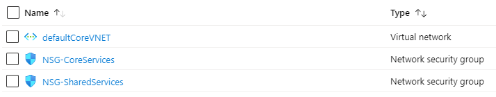

# networkHub-Net (Transit VNet) Template

This template will deploy a basic networking configuration to act as a core or transit Virtual Network (VNet), with basic subnets and Network Security Groups (NSG).

## Resources deployed:
- Virtual Network (VNet)
- Network Security Group (one per Subnet)



This template does not include a VPN. To add a VPN use the S2SVPN template to add a VPN configuration to an existing VNet. [S2SVPN Template](../002-networkHub-s2sVPN) 

## Parameters

The parameters for the template uses an array to define the name and IPv4 address prefix for creating subnets. Each object in the array represents a single subnet. The number of subnets created is determined by the number of objects defined by this parameter. 

```json
"coreVnetSubnets": {
    "type": "array",
    "metadata": {
        "description": "Array of Subnet names and prefixes"
    },
    "defaultValue": [
        {
            "name": "CoreServices",
            "addressPrefix": "10.10.1.0/24"
        },
        {
            "name": "SharedServices",
            "addressPrefix": "10.10.2.0/24"
        }
    ]
},
```

---


<a href="https://portal.azure.com/#create/Microsoft.Template/uri/https%3a%2f%2fraw.githubusercontent.com%2fhibbertda%2fazure-examples%2fvpnbreakout%2fTemplates%2fnetworkHub-Net%2fnetworkHub-net.azrm.json" target="_blank">
    
</a>


<a href="https://portal.azure.us/#create/Microsoft.Template/uri/https%3a%2f%2fraw.githubusercontent.com%2fhibbertda%2fazure-examples%2fvpnbreakout%2fTemplates%2fnetworkHub-Net%2fnetworkHub-net.azrm.json" target="_blank">
    
</a>


